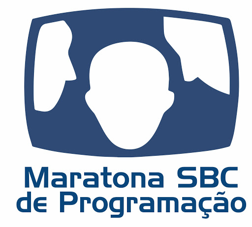
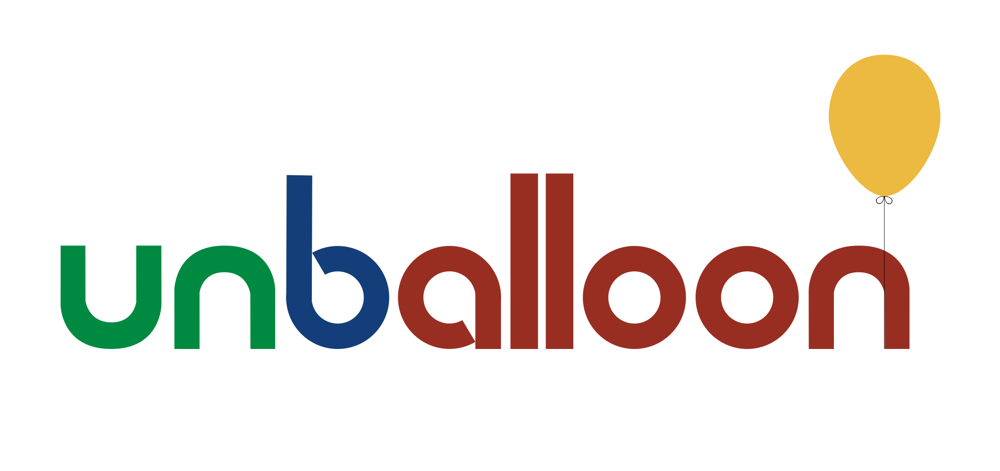

# Introdução

Introdução para novatos interessados em participar da Maratona de Programação.

## O que é a maratona?

A maratona de programação é uma competição em equipe em que são propostos aos competidores diversos problemas para serem solucionados. Os times são formados por 3 integrantes, que disputam pelo título de equipe com mais questões resolvidas em menos tempo.

Os problemas propostos estão ligados ao ramo da __programação competitiva__ e requerem dos competidores a elaboração de __programas__ que os resolvam de forma inteligente. Os times possuem 5 horas para resolverem cerca de 12 questões com apenas um computador por equipe.

Habilidades trabalhadas na maratona:

* Trabalho em equipe;
* Conhecimento de algoritmos e estruturas de dados;
* Domínio da ferramenta utilizada (linguagem de programação);
* Capacidade de lidar com problemas de forma rápida e eficiente.

## Programação Competitiva

A programação competitiva propõe questões a serem resolvidas com o uso de algoritmos conhecidos, estruturas de dados e ideias para adapta-los ao problema, tudo isso em um ambiente de competição.

O número de questões resolvidas, de soluções erradas submetidas e o tempo que cada questão levou para ser resolvida são os parâmetros utilizados para classificar as equipes.

Uma solução é considerada errada caso não resolva o problema corretamente ou caso não respeite os limites de tempo de execução e memória utilizada, requisitando assim que as soluções propostas sejam eficazes e eficientes.

## Por que participar da maratona?

A maratona estimula o pensamento computacional e matemático, a capacidade de resolução de problemas, o trabalho em equipe e o esforço do competidor, competências essas muito bem vistas no mercado de trabalho, principalmente nas grandes empresas de software, como __Google__, __Facebook__, __Microsoft__, __Vtex__, __InLoco__, __Nubank__, entre outras. Alguns alunos da UnB que participavam das maratonas de programação conseguiram estagios e empregos em muitas das empresas listadas, veja [aqui](https://gist.github.com/claudiosegala/29c7fc9745bcaec40d702aa2a1ef3088).

Além disso, a maratona é uma forma divertida e eficiente de colocar os assuntos aprendidos em sala de aula em prática, de conhecer novas pessoas, viajar para novos lugares a estudo e de se sentir motivado em continuar estudando ao longo da sua graduação.

## Primeiros passos

O primeiro passo para participar das maratonas de programação é possuir familiaridade com uma linguagem de programação. O __C++__ é uma ferramenta muito utilizada e recomendada para a resolução de problemas de programação competitiva, caso não conheça sua sintaxe veja [Ambiente](Ambiente/README.md).

Existem diversas formas de estudar programação competitiva, por meio de materiais, livros, vídeos, resolvendo questões, etc. Para saber mais sobre como estudar para a maratona veja [Estudos](Estudos).

Uma vez familiarizado com uma linguagem de programação e conhecendo os meios de estudo da programação competitiva, está pronto para estudar e treinar os assuntos abordados. Veja [Conteúdos](Conteúdo) e [Questões](Questões).

## Contatos

A Universidade de Brasília possui um grupo de estudos ([__UnBallon__](https://github.com/UnBalloon/programacao-competitiva)) para as maratonas de programação, hospedado no telegram, onde você pode tirar dúvidas sobre a maratona, questões, conteúdos, etc. Pode ser encontrado apenas pesquisando o nome UnBallon no telegram.

Existe também um grupo da maratona com pessoas de todo o país (__Maratona de Programação Brasil__), onde também se discute dúvidas sobre questões.

